## **Documentation for Project 8** 

### Apache Load Balancer Installation and Enabling Module

`sudo apt update`
`sudo apt install apache2 -y`
`sudo apt-get install libxml2-dev`
`sudo a2enmod rewrite`
`sudo a2enmod proxy`
`sudo a2enmod proxy_balancer`
`sudo a2enmod proxy_http`
`sudo a2enmod headers`
`sudo a2enmod lbmethod_bytraffic`

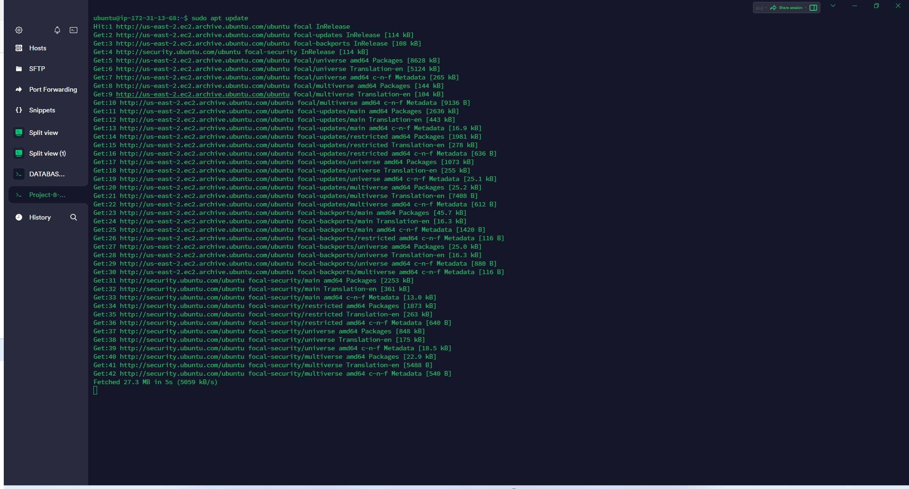
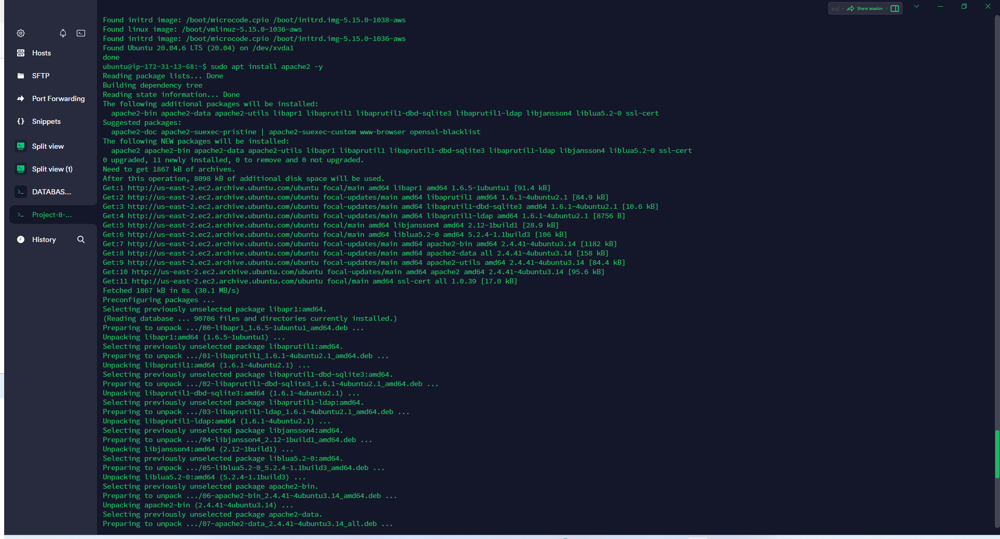
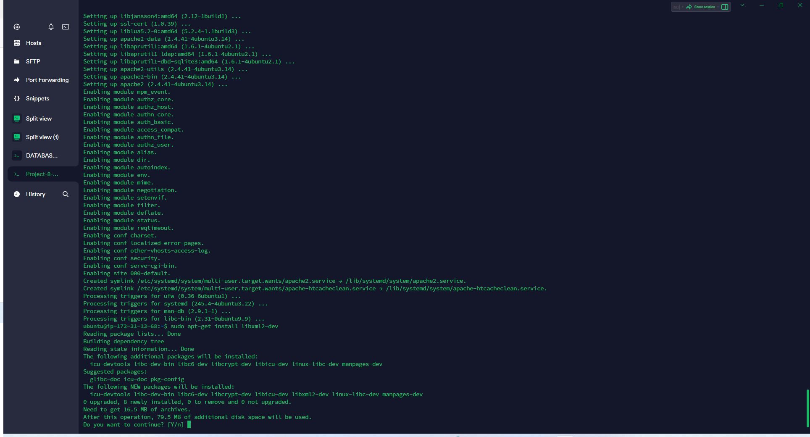
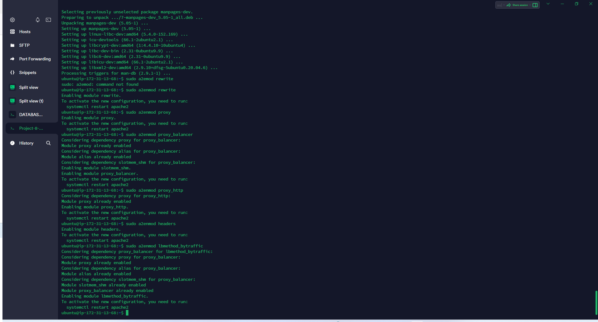
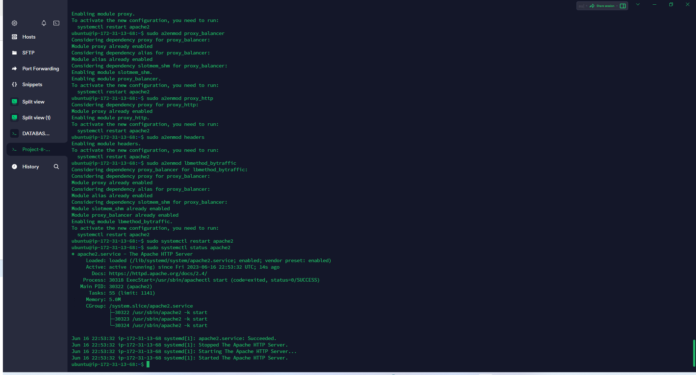

### Apache status verified as running

`sudo systemctl restart apache2`
`sudo systemctl status apache2`

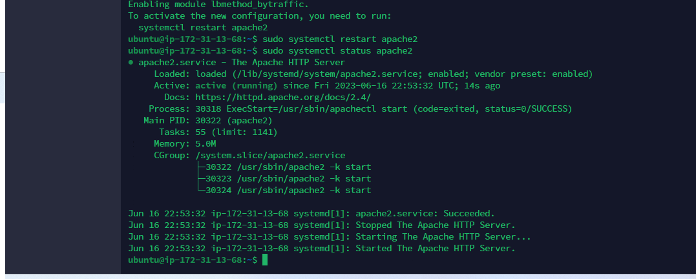

### Configuring Load Balancer

`sudo vi /etc/apache2/sites-available/000-default.conf`
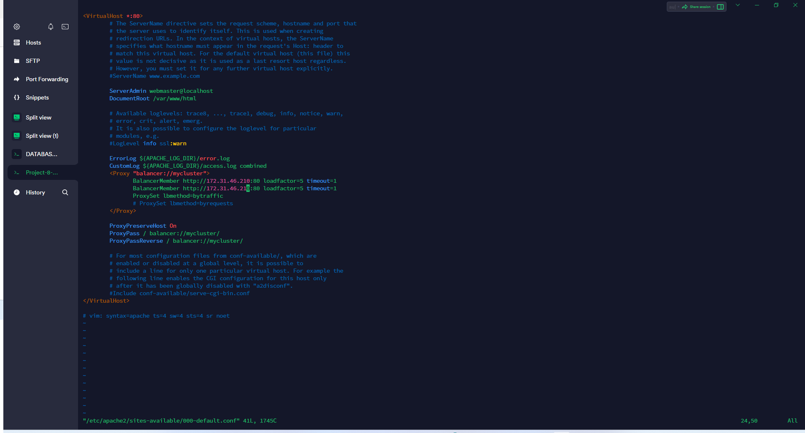

### Confirming even distribution of traffic by load Balancer

### HTTP get request logged in webserver 1 log file

`sudo tail -f /var/log/httpd/access_log`

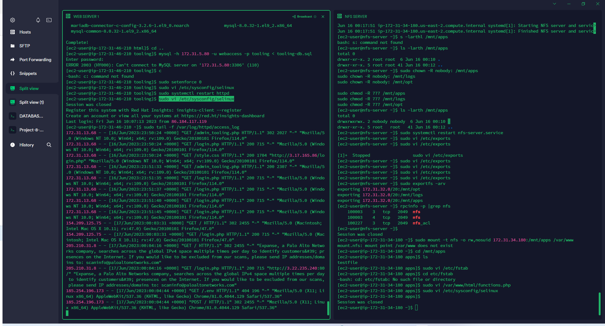

### HTTP get request logged in webserver 2 log file

`sudo tail -f /var/log/httpd/access_log`

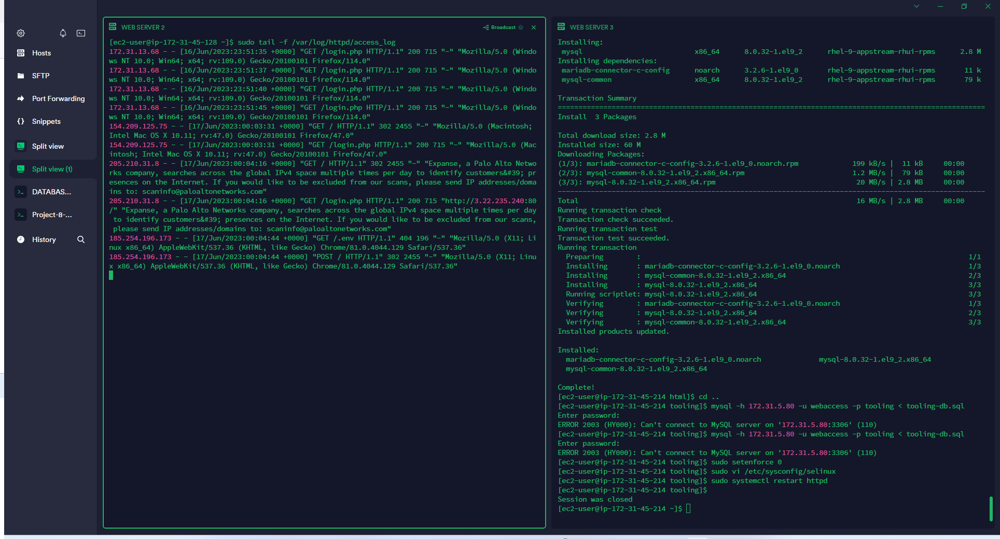

### Local DNS Names Resolution Configuration

`sudo vi /etc/apache2/sites-available/000-default.conf`

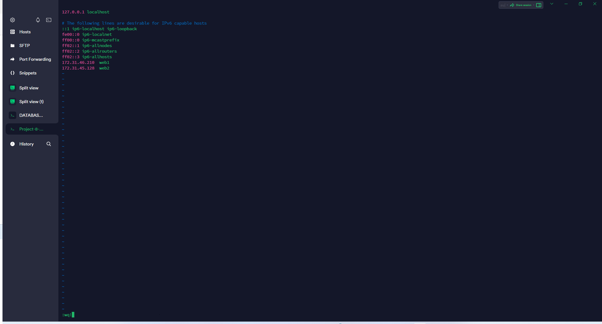

### Curling our webservers for access locally by our webservers

`curl http://Web1`
`curl http://Web2`

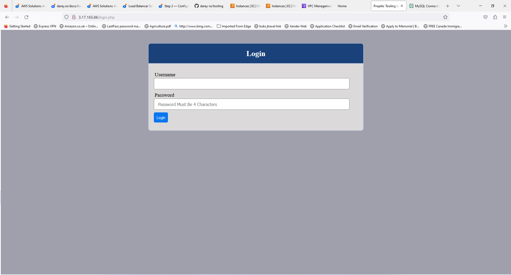

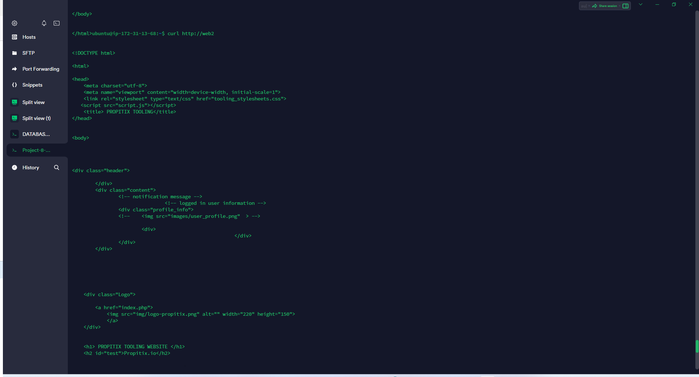